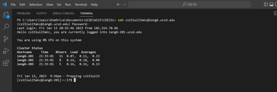
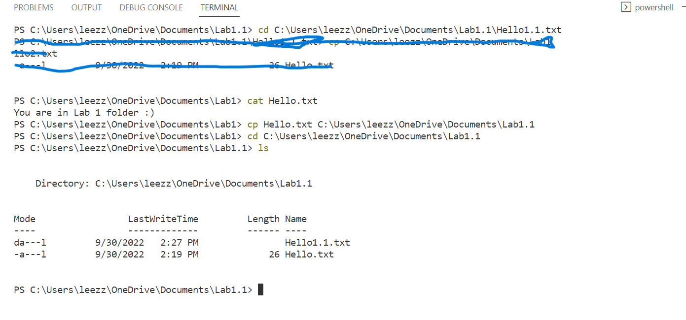

Hello! This is a tutorial on how to log into a course-specific account on ieng6.

## Step 1: Installing VScode

- Go to [visualstudio.com](https://code.visualstudio.com/)
- Click on download for Windows, or on the arrow to select your corresponding OS.

- Once installed, you should be able to see something like this:

## Step 2: Remotely Connecting
We will connect remotely through a terminal in VScode, but first you need your course-specific account.

### Finding your course-specific account

To do so, follow this [link](https://sdacs.ucsd.edu/~icc/index.php) and type your UCSD username and PID. It should follow the format "cs15lwi23xx". Where xx is specific to you. From this page, you can change your password.

### Resetting your password.

1. The password to this account is the same as your MyTritonLink account. To change it click on "Change Your Password" from the account lookup results page.

2. Go ahead and input your UCSD username and PID.

3. Type your current tritonlink password then type your new password.

4. Below the Confirm Password prompt, select No for Change MyTritonLink password.

5. Do NOT click Check Password. This will invalidate your new password. Instead click on the textbox under Confirm Password and press ENTER.

6. After resetting your password, this will come up.

### Remotely Connecting Through a Terminal

* To open a terminal on VScode, press ctrl + ` or click on "Terminal" on the top of the page and select "New Terminal".

* To connect, type the following command:\
`ssh cs15lwi23xx@ieng6.ucsd.edu`
* If it's your first time connecting to the server you might get a message ending in "(yes/no/[fingerprint]):". You should type "yes" and press enter.
* Then the terminal will ask for your password.
* Once you're logged in, you'll get a message like the one in the image.

## Step 3: Try Some Commands 

We'll try running the commands `cd`, `ls`, `pwd`, `mkdir`, and `cp`.

Whenever you see `~`, it stands for the home directory.
* `cd` stands for "change directory" and its function is to change to another directory (self-explanatory).

    * `~> cd ~\otherDirectory`

* `ls` lists the elements inside a directory.
    * `~> ls`

* `pwd` sta
nds for "print working directory" and that is exactly what it does.

Below is an example, be careful to follow each line.

* `mkdir` creates a folder in your current directory.
    * `~> mkdir newFolder`

* `cat` displays the content of a file.
* `cp` copies a file into another directory.
    *  `~> cp file.txt ~\otherDirectory`

That's it!!