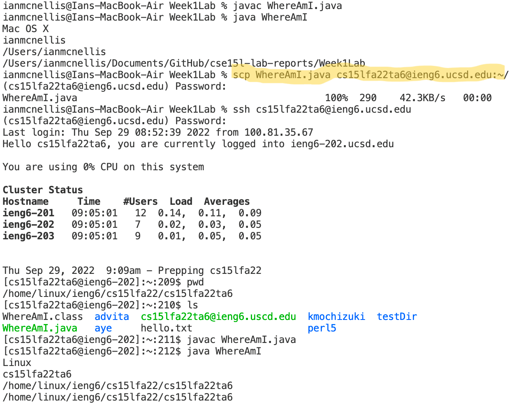
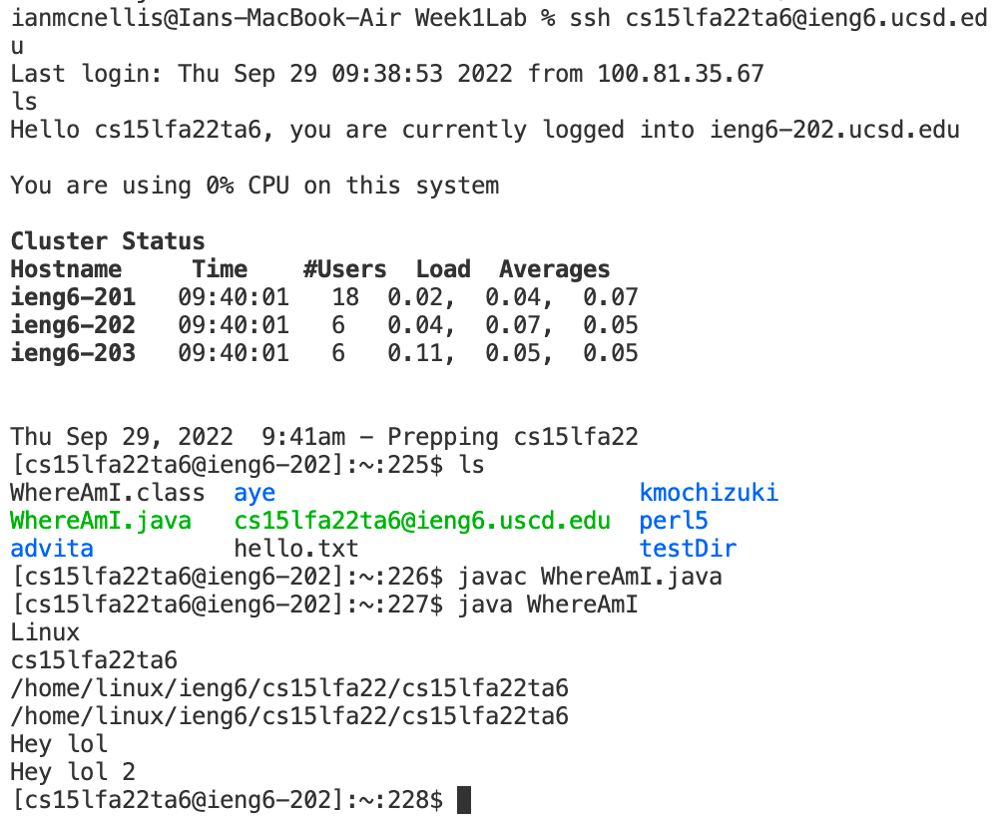

Hello! This is a tutorial on how to log into a course-specific account on ieng6.

## Step 1: Installing VScode

- Go to [visualstudio.com](https://code.visualstudio.com/)
- Clik on download for Windows, or on the arrow to select your corresponding OS.

- Once installed, you should be able to see something like this:

## Step 2: Remotely Connecting
We will connect remotely through a terminal in VScode, but first you need your corse-specific account.

### Finding your course-specific account

To do so, follow this [link](https://sdacs.ucsd.edu/~icc/index.php) and type your UCSD username and PID. It should follow the frmat "cs15lfa22xx". Where xx is specific to you. From this page, you can change your password.

### Resetting your password.

1. The password to this account is the same as your MyTritonLink accoubt. To change it click on "Change Your Password" from the account lookup results page.

2. Go ahead and input your UCSD username and PID.

3. Type your current tritonlink password then type your new password.

4. Below the Confirm Password prompt, select No for Change MyTritonLink password.

5. Do NOT click Check Password. This will invalidate your new password. Instead click on the textbox under Confirm Password and press ENTER.

6. After resetting your password, this will come up.

### Remotely Connecting Through a Terminal

* To open a terminal on VScode, press ctrl + ` or click on "Terminal" on the top of the page and select "New Terminal".

* To connect, type the following command:\
`ssh cs15lfa22xx@ieng6.ucsd.edu`
* Then the terminal will ask for your password.

* I reset my password yesterday during lab and haven't been able to log in since. I tried changing it again this morning to no avail.

## Step 3: Try Some Commands 

We'll try running the commands `cd`, `ls`, `pwd`, `mkdir`, and `cp`.

Whenever you see `~`, it stands for the home directory.
* `cd` stands for "change directory" and its function is to change to another directory (self-explanatory).

    * `~> cd ~\otherDirectory`

*`ls` lists the elements inside a directory.
    * `~> ls`

*`pwd` stannds for "print working directory" and that is exactly what it does.

Below is an example, be careful to follow each line.

* `mkdir` creates a folder in your current directory.
    * `~> mkdir newFolder`

* `cat` displays the content of a file.
* `cp` copies a file into another directory.
    *  `~> cp file.txt ~\otherDirectory`

## Moving Files with scp

`scp` is a command used to copy a file from your computer (referred to as the client) to a server.

Think of it as when you want to transfer a picture or a document from your cellphone to your laptop and you email it to yourself.\
It is used as follows:\
`~> scp file.txt cs15lfa22xx@ieng6.ucsd.edu:~/`

The following image is what me and my group mates followed as Ian McNellis worked with a TA's account in their laptop.

## Setting an SSH Key

Eventhough the `scp` commans is very useful, it took my lab group over 2 minutes to copy a file to the server. 

`ssh` keys can be used to replace the login process.
It consists on creating a pair of files. Called a *public key* in the server and a *private key* in the client computer.

To generate the keys you have to type the following in the client computer:

` ssh-keygen`

Then the terminal will ask you for a file in which to save they key:

If you have a Windows OS, you have to follow several additional steps from [here](https://docs.microsoft.com/en-us/windows-server/administration/openssh/openssh_keymanagement#user-key-generation).

My lab group edited the file WhereAmI.java from the client  twice. First we added a `System.out.println("Hey lol")` and copied the file to the server without the ssh keys. 

After, we added a `System.out.println("Hey lol 2")` after we added the ssh keys. Then we copied the java file to the server using the keys.

In the following screenshot we logged in to the server and ran the WhereAmI.java file to check if the file had been copied correctly.

It was! You can see the "Hey lol 2" at the bottom displayed from the server.

## Optimizing Remote Running

My lab group didn't reach this part of the lab. 