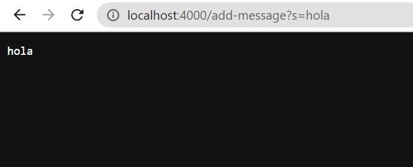
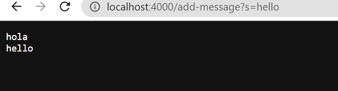
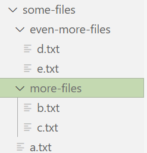
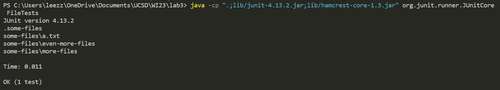
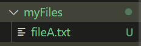
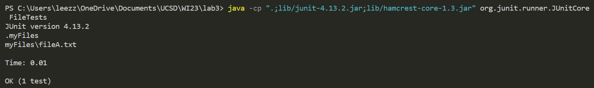

### Lab Report 2 - Servers and Bugs

## **Part 1**

# Code for StringServer:

```
//code from week 2 wavelet repository
import java.io.IOException;
import java.net.URI;
import java.util.*;

class Handler implements URLHandler {
    // The one bit of state on the server: a number that will be manipulated by
    // various requests.
    String currentString;

    public String handleRequest(URI url) {

        if (url.getPath().equals("/")) {
            return String.format("Use the path \"add-message\" to add your request");
        }

        else if(url.getPath().contains("/add-message")){
            String[] concatParameters = url.getQuery().split("=");
            if (concatParameters[0].equals("s")){

                String toConcat = concatParameters[1];

                if(currentString == null){
                    currentString = toConcat;
                }
                else{
                    currentString = String.format(currentString + "\n" + toConcat);
                }

                return currentString;
            } 
        }

        return "404 Not Found!";
    }
        
} 

class StringServer {
        public static void main(String[] args) throws IOException {
            if(args.length == 0){
                System.out.println("Missing port number! Try any number between 1024 to 49151");
                return;
            }

            int port = Integer.parseInt(args[0]);

            Server.start(port, new Handler());
        }
}
```

# Screenshots of me using `/add-image`:




I am calling the method `handleRequest(URI url)`

First, the method checks if there is a path that mathces `/` or `/add-message`. In this case it matched the latter.

Then the query puts the strings divided by `=` into an array. The query has to look like `?s=<request>`. Thus, if the first element in the array is an `s` it stores the `<request>` part into the second element of the array.

The class Handler has a string `currentString` as a field which is the string the code concatenates all the requests to. If the String is null, meaning it's the first time we're adding to the String, then the String variable inside the method `toConcat` is assigned directly to `currentString`. This is what happens in this case. Finally it returns the field variable `currentString`.  



This is the second time in a row I used `/add-message`. The algorithm is essentially the same until it checks if the field `currentString` is null. This time it's not since it has already been assigned the first `hola` string. Now it will assign this field to a formatted string:  
`String.format(currentString + "\n" + toConcat)`  
Finally, it returns the field variable `currentString`. 

## **Part2**

A failure-inducing input for the buggy program, as a JUnit test and any associated code (write it as a code block in Markdown).

# JUnit test with failure-inducing input:
```
@Test
    public void testGetFiles() throws IOException{

        File file = new File("some-files/");

        List<File> fileList = FileExample.getFiles(file);

        for(File currentFile : fileList){

            System.out.println(currentFile.toString());   
             }
    }
```

# File Structure:



# Symptom




# JUnit test with nonfailure-inducing input:
```
@Test
    public void testGetFiles() throws IOException{

        File file = new File("myFiles/");
        
        List<File> fileList = FileExample.getFiles(file);

        for(File currentFile : fileList){

            System.out.println(currentFile.toString());   
             }
    }
```   
# File Structure


# Symptom
  

# Buggy Code
```
static List<File> getFiles(File start) throws IOException {
	  File f = start;
	  List<File> result = new ArrayList<>();
	  result.add(start);
	  if(f.isDirectory()) {
	    File[] paths = f.listFiles();
	    for(File subFile: paths) {
	      result.add(subFile);
	    }
	  }
	  return result;
	}
```

# Fixed Code

```
static List<File> getFiles(File start) throws IOException {
	  List<File> result = new ArrayList<>();
    
	  if(start.isDirectory()) {
	    
      readPath(start, result);
	  }
	  return result;
	}

  public static void readPath(File currentFile, List<File> currentList) throws IOException {

    File[] paths2 = currentFile.listFiles();

    if(paths2 == null){
      return;
    }

    for(File currentSubFile : paths2) {

      readPath(currentSubFile, currentList);
      if(currentSubFile.isFile()){
        currentList.add(currentSubFile);
      }
      else{
        continue;
      }

    }
```
# Why the fix addresses the issue.

First, I got rid of the line: `File f = start;` <br> Then I got rid of what is inside of the `if` statement and added a recursive method that went as deep into the file as needed to get the files and add them to ArrayList `result`.<br> The recursive method `readPath` is void and accepts the current directory, which is the input, and the ArrayList of files `result`.  It stores the files and directories in the current directory into an array of files and returns if this is empty, meaning if there are no files or folders inside the current one.<br>Then it goes through every instance of the array and calls the method `readPath`. If the current file element is a file it adds it to the ArrayList `result`, otherwise it skips this instance.<br>
This fixes the issue because the previous code only peeked into the files and directories inside the current directory once. Plus, it didn't filter out the directories from the files.
# Something I learned 

I learned how to build a server and how to run it remotely. Alo, I learned what ports are and how servers worked.
