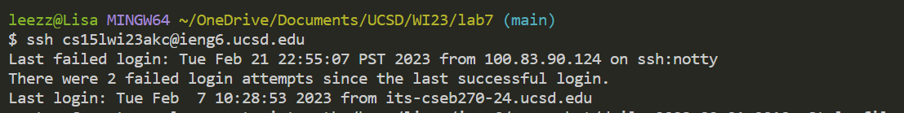
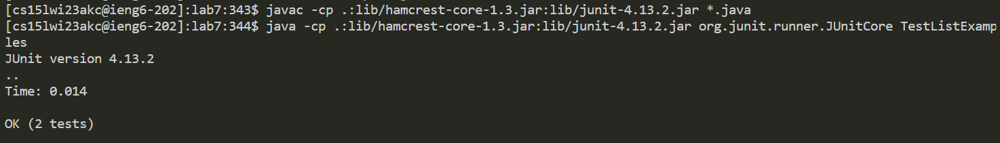

# Lab Report 4 - Challenge Tasks

## 1. Log into ieng6

The `ssh cs15lwi23akc@ucsd.edu` command was typed. Then I pressed `<enter>`.
## 2. Clone your fork of the repository from your Github account

Keys pressed: `<up><up><up><up><up><up><up><up><enter>`.
The `git clone git@github.com:lpaulette/lab7.git` command was 8 up in my history, so I pressed the up arrow 8 times and ran it.

Keys pressed: `<up><up><up><up><up><up><up><up><enter>`. The  `cd lab7/` command was 8 up in my history after the previous command was added, so I pressed the up arrow 8 times and ran it.
## 3. Run the tests, demonstrating that they fail

Keys pressed: `<up><up><up><up><up><up><up><up><enter>`.
The `javac -cp .:lib/hamcrest-core-1.3.jar:lib/junit-4.13.2.jar *.java` command was 8 up in my history, so I pressed the up arrow 8 times and ran it. Then the `java -cp .:lib/hamcrest-core-1.3.jar:lib/junit-4.13.2.jar org.junit.runner.JUnitCore TestListExamples1` command was 8 up in my history so I accessed it and ran it the same way.

## 4. Edit the code file to fix the failing test

Keys pressed: `<up><up><up><up><up><up><up><up><enter>`. The `nano ListExamples.java` command was 8 up in my history, so I pressed the up arrow 8 times and ran it.

Then I pressed down until I ended up on the last `index1` in the code. Then I edited `index1` for `index2`. Then I pressed `<CTRL-O><enter><CTRL-X><enter>`.
## 5. Run the tests, demonstrating that they now succeed

Keys pressed: `<up><up><up><enter>`.
The `javac -cp .:lib/hamcrest-core-1.3.jar:lib/junit-4.13.2.jar *.java` command was 3 up in my history, so I pressed the up arrow 8 times and ran it. Then the `java -cp .:lib/hamcrest-core-1.3.jar:lib/junit-4.13.2.jar org.junit.runner.JUnitCore TestListExamples1` command was 3 up in my history so I accessed it and ran it the same way.

## 6. Commit and push the resulting change to your Github account

Keys pressed: `<up><up><up><up><up><up><up><up><enter>`. The `git add ListExamples.java` command was 8 up in my history, so I pressed the up arrow 8 times and ran it. Then the `git commit -m "changed ListExamples"` was 8 up in the history so I accessed it and ran it the same way. And finally, I accessed and ran the command `git push` the same way.