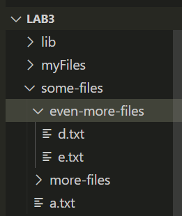
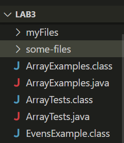
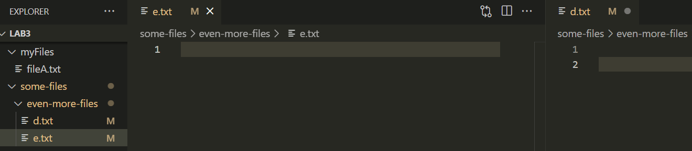
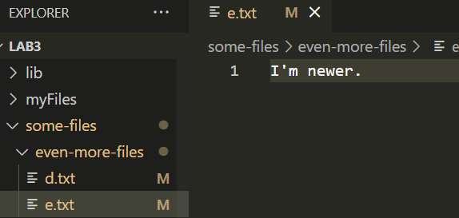

##Lab Report 5

## **Find**

# find `<dir>` -name `file-name`


This combination recursively searches for the files named `file-name` in the `<dir>` path. It returns the complete paths of the files found.\
[Link to source.](https://www.ibm.com/docs/en/aix/7.2?topic=f-find-command)

In the following code block, I applied this find combination in the repository lab3 to look for the nested file e.txt.

```
leezz@Lisa MINGW64 ~/OneDrive/Documents/UCSD/WI23/lab3 (main)
$ find ./ -name e.txt
./some-files/even-more-files/e.txt
```

## File Structure 


In the following code block I tried using a word which more than one file had in common. It ended up working only with the full name of the file.

```
leezz@Lisa MINGW64 ~/OneDrive/Documents/UCSD/WI23/lab3 (main)
$ find ./ -name Array

leezz@Lisa MINGW64 ~/OneDrive/Documents/UCSD/WI23/lab3 (main)
$ find ./ -name ArrayExamples

leezz@Lisa MINGW64 ~/OneDrive/Documents/UCSD/WI23/lab3 (main)
$ find ./ -name ArrayExamples.java
./ArrayExamples.java
```

## File Structure



# find `<dir>` -mmin `n`

This combination recursively searches for the files in the `<dir>` directory that have been edited in the past `n` minutes.
[Link to source.](https://www.ibm.com/docs/en/aix/7.2?topic=f-find-command)

In the following code block I edited a file named a.txt and used this combination right after. The file is mentioned at the very bottom.

```
leezz@Lisa MINGW64 ~/OneDrive/Documents/UCSD/WI23/lab3 (main)
$ find . -mmin -60
./.git
./.git/COMMIT_EDITMSG
./.git/FETCH_HEAD
./.git/index
./.git/logs/HEAD
./.git/logs/refs/heads/main
./.git/logs/refs/remotes/origin/HEAD
./.git/logs/refs/remotes/origin/main
./.git/logs/refs/remotes/upstream/HEAD
./.git/objects
./.git/objects/07
./.git/objects/07/3ca68d8e5cb8e60f83452af89205ce3a9c7b8b
./.git/objects/25
./.git/objects/25/5bbf377a9ea6803989a5accacd5366a6574e35
./.git/objects/5b/36bc8e38a6098d83275af7b5809f1fb5f66019
./.git/objects/7c
./.git/objects/7c/0f82f1efcc184cbf29bc10ab8346533f5cfff1
./.git/objects/a1
./.git/objects/a1/611a05841ff6fe1c15bb327887026ca37556f1
./.git/objects/a1/e49c0beab3cb5183ad0c19326326953544ecf2
./.git/objects/ae
./.git/objects/ae/a72a95fbf432cccb8062bbc0cc1c6d698f1be9
./.git/objects/b4
./.git/objects/b4/b1651b35e22c29f75cf2baa606eb76cb986985
./.git/objects/dc
./.git/objects/dc/0de5040400958b159e56e3b7477e9bbb9ddd49
./.git/objects/df
./.git/objects/df/105612eaf7279ef7eedac5e0d511462ef2dda3
./.git/objects/e0
./.git/objects/e0/227c23ef71406341d4ce3e833bb1b81e80bfa3
./.git/objects/f0
./.git/objects/f0/c348c119683bdf9df444f095bf11846045cd4a
./.git/objects/f6
./.git/objects/f6/4844cbfd949311b1e061a3623b85aee927f022
./.git/objects/pack/pack-f9689efa3ce1202d62dc98e99c9d934a2816ee58.pack
./.git/refs/heads
./.git/refs/heads/main
./.git/refs/remotes/origin
./.git/refs/remotes/origin/HEAD
./.git/refs/remotes/origin/main
./.git/refs/remotes/upstream
./.git/refs/remotes/upstream/HEAD
./some-files/a.txt
```

In the following code block I used -mmin on a folder in lab3 that hadn't been edited.

```
leezz@Lisa MINGW64 ~/OneDrive/Documents/UCSD/WI23/lab3 (main)
$ find ./some-files/more-files/ -mmin -1

leezz@Lisa MINGW64 ~/OneDrive/Documents/UCSD/WI23/lab3 (main)
$ 
```

# find `<dir>` -size `n`c

This combination recursively searches for the files that are `n` bytes long inside the `<dir>` directory.
[Link to source.](https://www.ibm.com/docs/en/aix/7.2?topic=f-find-command)

In the following code block I used this combination to look for files that were 0 bytes long, or empty.

```
leezz@Lisa MINGW64 ~/OneDrive/Documents/UCSD/WI23/lab3 (main)
$ find . -size 0c
.
./.git
./.git/hooks
./.git/info
./.git/logs
./.git/refs/heads
./.git/refs/remotes
./.git/refs/remotes/origin
./.git/refs/remotes/upstream
./.git/refs/tags
./java-version
./jdb
./lib
./myFiles
./myFiles/fileA.txt
./run
./some-files
./some-files/even-more-files
./some-files/more-files
./stop
```

In the following code block I tried using the -size combination in a more specific directory with two .txt files. Neither came up in the previous command, and when I checked them they had two lines. I deleted a line from the e.txt file and tried the command again. The e.txt file is now empty.

```
leezz@Lisa MINGW64 ~/OneDrive/Documents/UCSD/WI23/lab3 (main)
$ find ./some-files/even-more-files/ -size 0c
./some-files/even-more-files/
./some-files/even-more-files/e.txt
$

```

## File structure and text files


# find `file1` -newer `file2`

This combination returns the name of `file1` or the current file if `file1` has been edited mroe recently than `file2`.
[Link to source.](https://www.ibm.com/docs/en/aix/7.2?topic=f-find-command)

In the following code block I wrote something on the text file e.txt and saved it. Right after I used the -newer command with this text file and a java file that I haven't edited.

```
leezz@Lisa MINGW64 ~/OneDrive/Documents/UCSD/WI23/lab3 (main)
$ find some-files/even-more-files/e.txt -newer ArrayTests.java
some-files/even-more-files/e.txt
```

In the following code block I had the file e.txt open and was selected in the file structure as follows: 



Then I used the -newer command with `file2` as d.txt. A text file I had not edited.

```
leezz@Lisa MINGW64 ~/OneDrive/Documents/UCSD/WI23/lab3 (main)
$ find -newer some-files/even-more-files/d.txt
./some-files/even-more-files/e.txt
```


